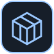
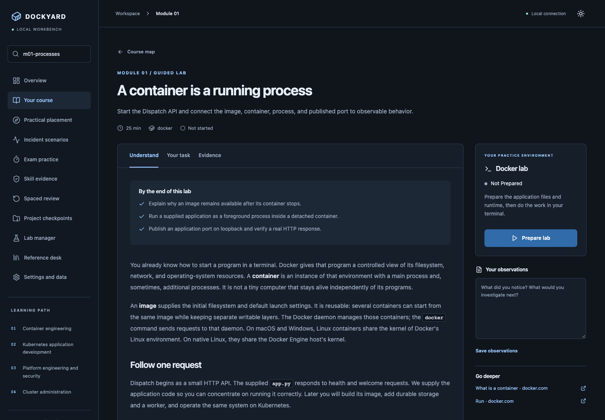

<p align="center">
  
</p>
<h1 align="center">Dockyard</h1>
<p align="center"><strong>Learn Docker and Kubernetes by operating a real system.</strong></p>
<p align="center">A personal learning workbench for macOS, Linux, and Windows through WSL 2, with browser lessons, external WezTerm sessions, and an evolving Dispatch application.</p>
<p align="center"><a href="#start-learning">Start learning</a> · <a href="docs/user-guide.md">User guide</a> · <a href="docs/curriculum.md">Curriculum</a> · <a href="docs/runtime-evidence.md">Runtime evidence</a></p>

## Start learning

This checkout includes a local launcher after installation.
A local Docker Engine and WezTerm provide the practical lab environment.
See [platform setup](docs/platforms.md) for macOS, Linux, and Windows/WSL prerequisites.
The source installer also needs Node/npm and uv; it downloads application dependencies, builds the browser assets, and installs into this repository's private environment.
It does not alter shell configuration or Docker Desktop settings.

```sh
./scripts/install.sh
./dockyard doctor
./dockyard
```

The browser opens a local workbench with a one-time sign-in.
Choose **Practical placement** if you already work with containers, or **Start learning** for the complete sequence.
Prepare a lab, open its WezTerm session, and check the behavior you created.
Tools, container images, and native VM packages download as required; Lab Manager can prefetch a module or track.

[](docs/assets/workbench.png)

## The learning loop

Read a short explanation, make a prediction, operate the real environment, and inspect the evidence.
Checks examine files, resource identity, and running behavior rather than command history.
Hints and reference solutions stay separate from independent demonstrations.

The course contains 96 teaching labs and missions across 24 modules, 12 incident scenarios, and four original timed CKA/CKAD-oriented practice exams.
Dispatch grows from one process into a distributed application, with Compose, Kubernetes, delivery automation, security, and native kubeadm administration.
The [objective map](docs/sources/objective-map.md) connects the published objectives to explanations, practice, and assessment.

Successful missions create immutable source checkpoints.
Carry selected files into later missions, keep a portfolio of infrastructure and operational evidence, and revisit skills through spaced review.
Progress archives move notes and historical evidence between profiles while preserving current workspaces.

No AI service, account, telemetry, cloud credentials, or paid infrastructure is required.
Local labs and original practice exams do not reproduce production failure domains or certification proctoring.
Full CKS preparation is outside this release's scope.

## Working locally

The browser and CLI share one assessment service.
The ordinary external shell has your user privileges; resource ownership checks are not an operating-system sandbox.
Dockyard scopes cleanup to recorded, verified resources and keeps native VM labs and application clusters mutually exclusive.

Lessons and saved progress work offline.
Lab Manager reports pinned cache availability and identifies remaining network-dependent build or bootstrap steps.
See [operation and recovery](docs/user-guide.md#operate-your-labs) before resetting or cleaning a lab.

## Development

```text
dockyard/
├── frontend/                 React workbench and installed-browser journeys
├── src/dockyard/
│   ├── content/              Canonical lessons, checkpoints, objectives, and pins
│   ├── probes/               Observations used by behavior checks
│   ├── runtimes/             Owned Docker, kind, and Lima lifecycle adapters
│   ├── service.py            Shared browser and CLI operations
│   └── web.py                Authenticated loopback API
├── tests/                    Contracts and real-runtime integration gates
├── scripts/                  Local installation and contract generation
├── docs/                     Learning, operation, and verification guides
└── pyproject.toml            Python package and development configuration
```

Use the [maintenance guide](docs/maintenance.md) for source setup, generated contracts, and release checks.
The [platform validation](docs/platform-validation.md) records cross-platform checks and remaining verification limits.
The [original release validation](docs/release-validation.md) preserves the macOS baseline.
The [runtime evidence log](docs/runtime-evidence.md) records the underlying staged observations.

For help, include the activity ID, action, relevant diagnostic, app version, and `./dockyard doctor` output.
Exclude kubeconfigs, credentials, private keys, and raw lab databases.
